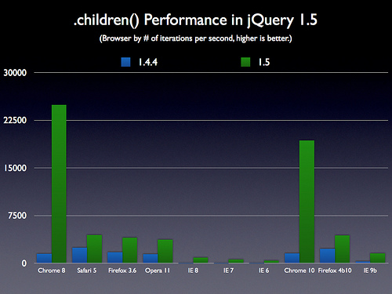
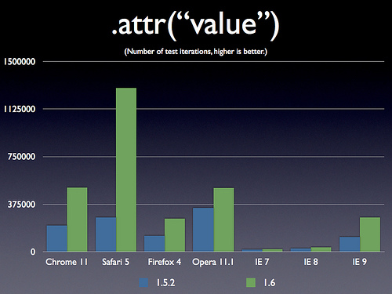
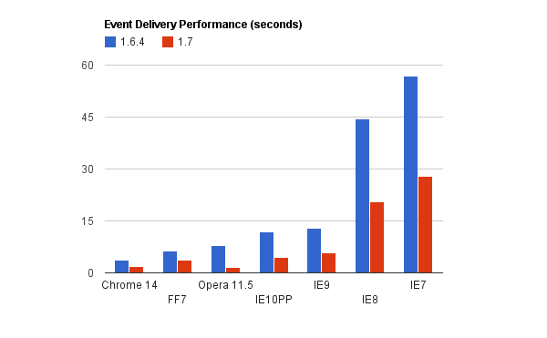

<!SLIDE>

# Len Smith #
# @ignu #
# http://iggy.nu #

<!SLIDE>

# Modern jQuery

<!SLIDE>

# Why Upgrade? #

<!SLIDE >

<!SLIDE>

<!SLIDE>

<!SLIDE bullets incremental transition=scrollUp>

# Experiment often #

* Browser Console
* Bookmarklet
* JS Fiddle

<!SLIDE bullets incremental transition=scrollUp>

## Selector performance
Selector performance normally isn't too big of an issue.  It can become an issue if we're using large doms.

	@@@javascript
		$(".something_else");
		$("#blah  .something_else");
		$("#blah").find(".something_else");

<!SLIDE bullets incremental execute transition=scrollUp>

## Selector performance

filters alone are really bad. 

	@@@javascript
		$(":hidden");

they check every element on the page to see if it has that property!

	@@@javascript     
		$("input:hidden");

<!SLIDE bullets incremental execute transition=scrollUp>

# Writing to the Dom is Slow #

<!SLIDE bullets incremental execute transition=scrollUp>

# detach

	@@@javascript
	  var $pre    = $("pre:visible");
	  var $parent = $pre.parent();

	  $pre.detach()
	    .append($("
", { text : "hello"}))
	    .appendTo($parent);

<!SLIDE>

# Embrace Functional Programing	

<!SLIDE execute transition=scrollUp>

	@@@javascript
	  var doit = function() { alert('hi'); }

	  $(function() {
	    doit();
	  });

<!SLIDE execute transition=scrollUp>

	@@@javascript
		var doit = function() { alert('hi') }

  		$(doit);

<!SLIDE transition=scrollUp>
	@@@javascript
		$tabLinks.on("click", showTab)

<!SLIDE execute>

# Self Executing Functions

	@@@javascript
	  var x = function () { 
	  	alert('hi');
	  }();

	  alert(x);
<!SLIDE execute>

# Self Executing Functions

	@@@javascript
		var user = (function(){ 
		  var secretVariable = 3.14;

		  return function() {
		  	alert(secretVariable);
		  };
		})();

		user();

<!SLIDE execute transition=scrollUp>
	@@@javascript
		var x = function(message){ 
		  alert(message); 
		}("hello");

<!SLIDE execute transition=scrollUp>
	@@@javascript
		var x = (function($){ 
		  alert(jQuery == $); 
		})(jQuery)

<!SLIDE>

# events

<!SLIDE>

# bind

	@@@javascript
	$("pre:visible").bind("click", function() {
		alert($(this).text() + " clicked");
	});

<!SLIDE execute>

# live

	@@@javascript
	$("pre:visible").live("click", function() {
		$(this).css("border", "1px solid red");
	});

<!SLIDE execute>

# on
	@@@javascript
	$("pre:visible").on("click", function() {
		alert($(this).text() + " clicked");
	});

[example](http://jsfiddle.net/ignu/vXQaQ/5/)

<!SLIDE execute>

# one
	@@@javascript
	$("pre:visible").one("click", function() {
		alert($(this).text() + " clicked");
	});

<!SLIDE execute>
# .end()

	@@@javascript
	 $("div:visible")
	  .find("pre")
  	    .css("font-size", "1em")
  	  .end()
  	  .fadeOut().fadeIn()

<!SLIDE execute>
# extend jQuery

	@@@javascript
	  $.fn.blink = function() {
	  	$(this).fadeOut().fadeIn();
	  	return this;
	  }

	  $("pre:visible").blink().blink();

<!SLIDE execute transition=scrollUp>

# Defered #

Decouples logic dependent on a task finishing from the task itself

<!SLIDE execute transition=scrollUp>
	@@@javascript
		var deferred1 = jQuery.Deferred(),
		    deferred2 = jQuery.Deferred()

		$.when(deferred1, deferred2)
		  .then(function() { alert("done"); })

		deferred1.resolve();
		deferred2.resolve();

<!SLIDE execute transition=scrollUp>
	@@@javascript
		var deferred1 = jQuery.Deferred(),
		    deferred2 = jQuery.Deferred()

		$.when(deferred1, deferred2)
		  .then(function() { alert("done"); })
		  .fail(function() { alert("error"); })
		  .always(function() { alert("it's over"); })

		deferred2.reject();

<!SLIDE>

# ajax

<!SLIDE execute transition=scrollUp>
	@@@javascript
		$.ajax({
		  url: "/something",
		  dataType: "json",
		  success: function() {
		   // do some stuff
		  }
		});

<!SLIDE>

# all ajax methods now return a deferred!

(this includes $.post, $.get, $getJSON)

[example](http://jsfiddle.net/ignu/5RDnf/3)

<!SLIDE execute transition=scrollUp>

#Use the correct http status.

<!SLIDE transition=scrollUp>

# don't return 200 with an error flag! 

	@@@javascript
		$.post("/saveUser", $form.serialize())
		  .success(function(data) {
		  	if (data.success_flag)
  		      // do some success stuff
  		    else
  		      // handle error
		  };

<!SLIDE transition=scrollUp>

# do retun a legit error code: 

	@@@javascript
		$.post("/saveUser", $form.serialize())
		  .success(showSuccessMessage)
		  .success(addUserToList)		  
		  .fail(handleError)
		  .always(removeUserEditModal);

<!SLIDE execute>
	@@@javascript
	  var $box = $("pre:visible")
	    .css("border", "1px solid red");

	  $box.on("click", function() {
	  	$(this).css("height", "+=10");
	  });

<!SLIDE execute>
	@@@javascript
	  var url = "http://www.cornify.com/js/cornify.js"
	  jQuery.getScript( url, function() {
        cornify_add();
        cornify_add();
	  });

<!SLIDE >

# $.data

* tries to use the correct variable type
* use HTML5 standard
* parses json values

[example](http://jsfiddle.net/ignu/h8wwg/)

<!SLIDE execute>
#$.map

don't use underscore if you don't have to

	@@@javascript
		var a = $.map($("pre"),function(pre){
		  return $(pre).text();
		});
		console.log(a);

<!SLIDE execute>
	@@@javascript
	 var $first = $("div:visible") 
  	  .fadeOut(400).fadeIn()
 
   	  var $second = $("pre:visible")
  	    .fadeOut().fadeIn(1900)
        .fadeOut().fadeIn()
  	    .fadeOut().fadeIn();
  	 
  	 console.log($second.queue("fx").length);

  	 $.when($first.promise(), $second.promise())
  	  .done(function() {alert("all done");});

<!SLIDE bullets incremental>
# Some best practices in summary

* use the most specific selectors you can
* use ids instead of classes, and ids with finds
* use the latest jQuery possible
* cache your jQuery elements

<!SLIDE bullets incremental>
# What I forgot to mention

* consider using a CDN
* combine and minify your js sources
* include js at the bottom of your page

<!SLIDE execute>
# extra credit: fn

	@@@javascript
		alert(jQuery.fn == jQuery.prototype);

<!SLIDE execute>
# extra credit: 
## return false VS preventDefault
## stopPropagation VS stopImmediatePropagation

[example](http://jsfiddle.net/ignu/HQx2u/1/)

<!SLIDE execute>
# extra credit: proxy 

[example](http://jsfiddle.net/ignu/w3WZJ/1/)

<!SLIDE execute>
# extra credit: pipes 

	@@@javascript
		ajax("/getUser")
		  .pipe(getTwitterFeed)
		  .then(showUserOrderPanel);

<!SLIDE execute>
	@@@javascript
	  var url="https://raw.github.com/" +
	    "brandonaaron/" +
	    "jquery-cssHooks/master/boxshadow.js";

	  $("pre:visible")
	    .css("boxShadow", '#ccc 5px 5px');

<!SLIDE execute>
# questions?

<!SLIDE execute>
# Len Smith
# @ignu
# http://iggy.nu
